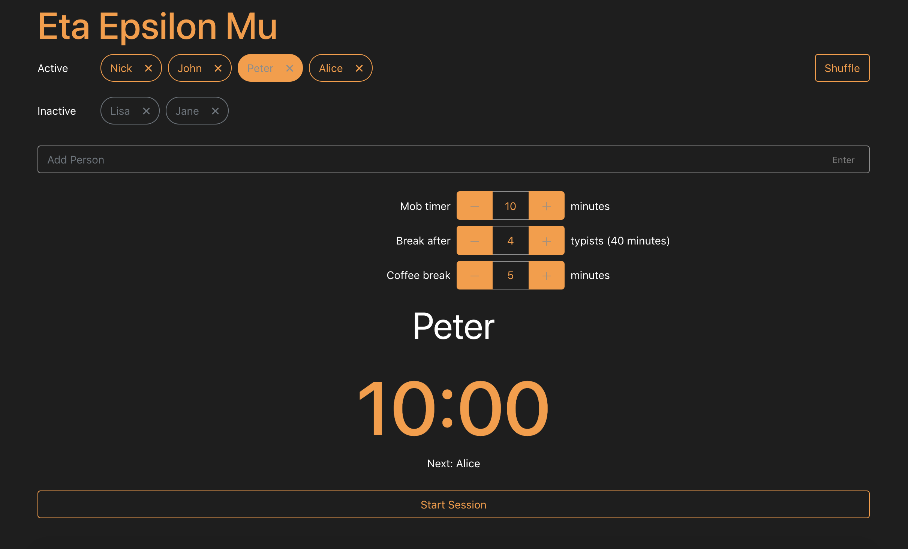
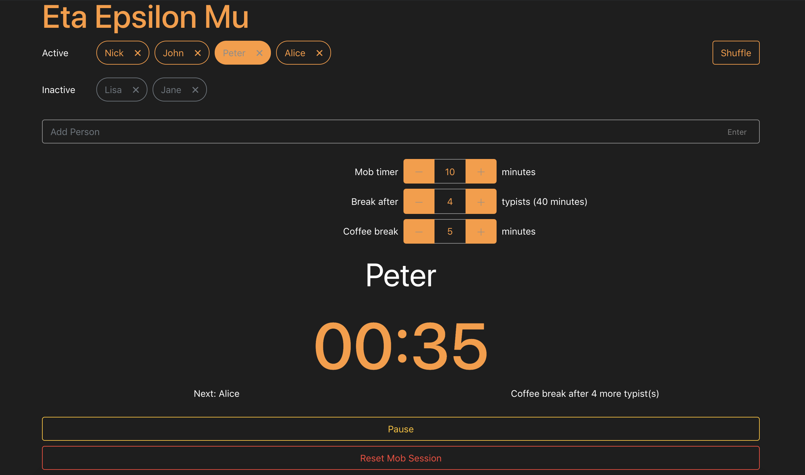

# Remote Mob Timer

This web application utilizes a synced timer together with browser notifications to facilitate remote mob programming. Each user joins the specific mob room through a shared link and will then be able to select active participant, get notifications on timer etc. The timer application is also suitable for other remote collaboration work.

- **Technology stack**: React and Firebase. Deployment is done through Google Cloud.
- **Status**: Alpha [CHANGELOG](CHANGELOG.md).
- **Demo**
  <a href="https://remotemob.io/" target="_blank">https://remotemob.io</a>

**Screenshots**:




## Dependencies

See `package.json` for a list of dependecies used in this project.

## Installation

```
npm install
```

Development

```
npm start
```

Production Bundle

```
npm run build
```

## Configuration

`env.local` is used for development. Get in contact in order to obtain the `production` env.

## Roadmap

- Remove rooms from firebase that have been inactive for a certain period of time.

* Implement tests.

- Refactor code.

## Known issues

Needs testing.

**Example**

If you have questions, concerns, bug reports, etc, please file an issue in this repository's Issue Tracker.

## Getting involved

General instructions on _how_ to contribute should be stated with a link to [CONTRIBUTING](CONTRIBUTING.md).

---

## Open source licensing info

1. [TERMS](TERMS.md)
2. [LICENSE](LICENSE)
3. [CFPB Source Code Policy](https://github.com/cfpb/source-code-policy/)

---

## Credits and references

1. https://www.remotemobprogramming.org/
